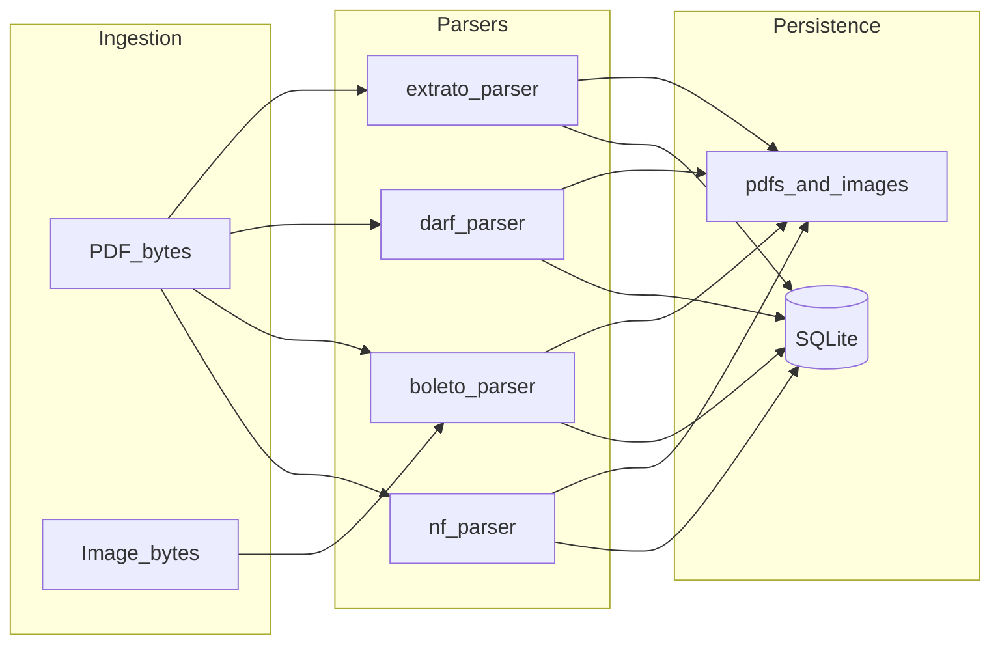

# Overview — pjtracker backend handoff

This pack documents **domain behavior, persistence, and extraction** for migrating off Streamlit toward a FastAPI backend. It intentionally **does not** specify UI layout, Streamlit widgets, CSS, or chart styling.

## Product scope

Brazil-focused company tooling bundled in this repo:

- **Notas Fiscais (NF-e, Campinas)**: PDF upload, field extraction, USD/BRL math, attachments, history, fiscal month tagging.
- **Boletos**: boleto PDF + optional payment receipt image, barcode matching, fiscal month.
- **DARFs**: DARF PDF + optional receipt, same receipt/barcode patterns as boletos, fiscal month.
- **Extratos**: main bank statement PDF; optional **caixinha** PDF; optional **Higlobe** USD statement; parsed JSON line items; fiscal month.
- **Analytics**: NF time series (USD, BRL, rates) over a date range.
- **Fiscal month completeness**: checks counts of NFs, boletos with receipts, DARFs with receipts, extratos with caixinha; Higlobe tracked separately as optional.

## Storage and layout

Defined in [`src/pjtracker/app.py`](../../src/pjtracker/app.py):

| Artifact | Location |
|----------|----------|
| SQLite database | `DB_PATH` → project root `pjtracker.db` |
| PDF files | `PDF_DIR` → `pdfs/` under project root |
| Images (receipts, NF attachments) | `IMAGES_DIR` → `images/` under project root |

`init_db()` creates directories as needed.

## LLM / extraction runtime

Shared client and models live in [`src/pjtracker/llm_extraction.py`](../../src/pjtracker/llm_extraction.py):

- **Base URL**: `MARITACA_BASE_URL` (default `https://chat.maritaca.ai/api`).
- **Model**: `MARITACA_MODEL` (default `sabiazinho-4`).
- **API key**: `MARITACA_API_KEY` environment variable, else first line of project-root `.token` (`TOKEN_PATH` in `llm_extraction`).
- Client: OpenAI-compatible `OpenAI(..., base_url=DEFAULT_BASE_URL)` via `_get_client()`.

Heavy OCR (boleto fallback, receipt OCR) uses **EasyOCR** and **pdf2image** in [`src/pjtracker/parsers/boleto_parser.py`](../../src/pjtracker/parsers/boleto_parser.py).

## Non-goals for this documentation

- Streamlit routes, `session_state`, or multi-page navigation.
- HTML/CSS for inline PDF links (replace with HTTP file download or static URLs in a new stack).
- Plotly chart appearance; only **data filters and formulas** are documented in [`04-operations-by-domain.md`](04-operations-by-domain.md).

## Diagram: data flow

## Related docs

- [`01-data-model.md`](01-data-model.md) — schema and indexes
- [`02-domain-rules-and-formats.md`](02-domain-rules-and-formats.md) — dates, deduplication, fiscal month
- [`03-parsers-and-extraction.md`](03-parsers-and-extraction.md) — parser inputs/outputs
- [`04-operations-by-domain.md`](04-operations-by-domain.md) — operations to expose
- [`05-suggested-api-surface.md`](05-suggested-api-surface.md) — REST sketch
